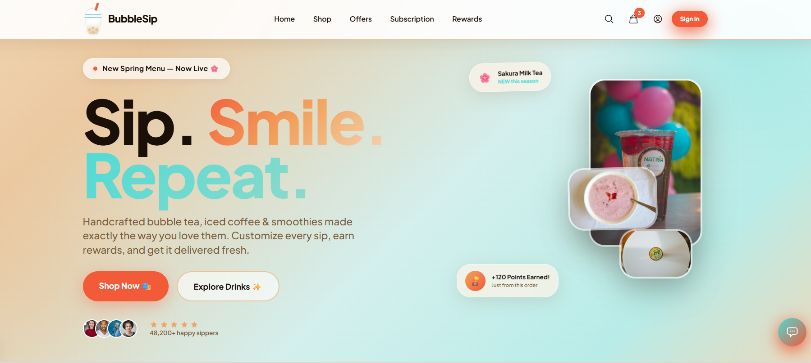

# Next.js

A modern Next.js 15 application built with TypeScript and Tailwind CSSو stylish coffee & bubble tea web experience built with a clean UI/UX approach.
BubbleSip offers users a smooth and visually engaging interface to explore drinks, products, and promotions in a modern café-inspired environment.

## 📸 Preview



## 🛠 Tech Stack

- **Next.js 15** - Latest version with improved performance and features
- **React 19** - Latest React version with enhanced capabilities
- **Tailwind CSS** - Utility-first CSS framework for rapid UI development
- **TypeScript / JavaScript**
- **HTML5**
- **CSS3**

## 🚀 Features

- Modern responsive UI
- Clean and elegant design
- Product showcase sections
- Smooth user experience
- Interactive layouts
- Reusable React components
- Mobile-friendly design
- Fast and optimized structure
- Organized folder architecture


## 🛠️ Installation

1. Install dependencies:
  ```bash
  npm install
  # or
  yarn install
  ```

2. Start the development server:
  ```bash
  npm run dev
  # or
  yarn dev
  ```
3. Open [http://localhost:4028](http://localhost:4028) with your browser to see the result.


## 🎨 Styling

This project uses Tailwind CSS for styling with the following features:
- Utility-first approach for rapid development
- Custom theme configuration
- Responsive design utilities
- PostCSS and Autoprefixer integration

## 📦 Available Scripts

- `npm run dev` - Start development server on port 4028
- `npm run build` - Build the application for production
- `npm run start` - Start the development server
- `npm run serve` - Start the production server
- `npm run lint` - Run ESLint to check code quality
- `npm run lint:fix` - Fix ESLint issues automatically
- `npm run format` - Format code with Prettier

## 📱 Deployment

Build the application for production:

  ```bash
  npm run build
  ```

## 👩‍💻 Author
**Heba Elgohary**
Frontend Developer passionate about building modern web experiences.

## 📬 Contact Me
LinkedIn: https://www.linkedin.com/in/heba-elgohary-a13074167/

GitHub: https://github.com/HebaAbdElhamed

Email: [hebaabdelhamede@gmail.com](mailto:hebaabdelhamede@gmail.com)


If you like this project:
Give it a ⭐ on GitHub
Share it with others
Follow for more projects
